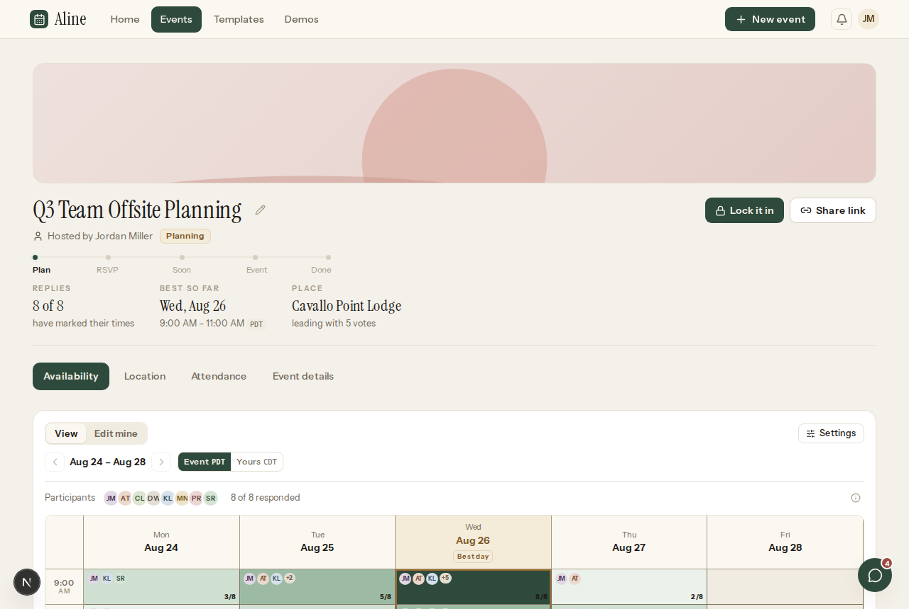
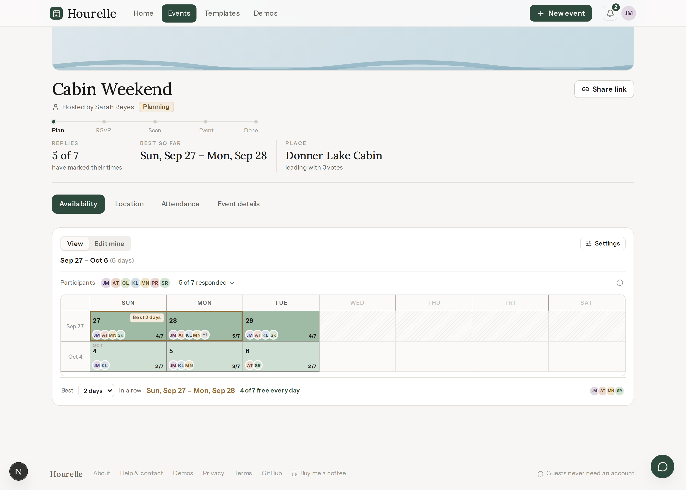
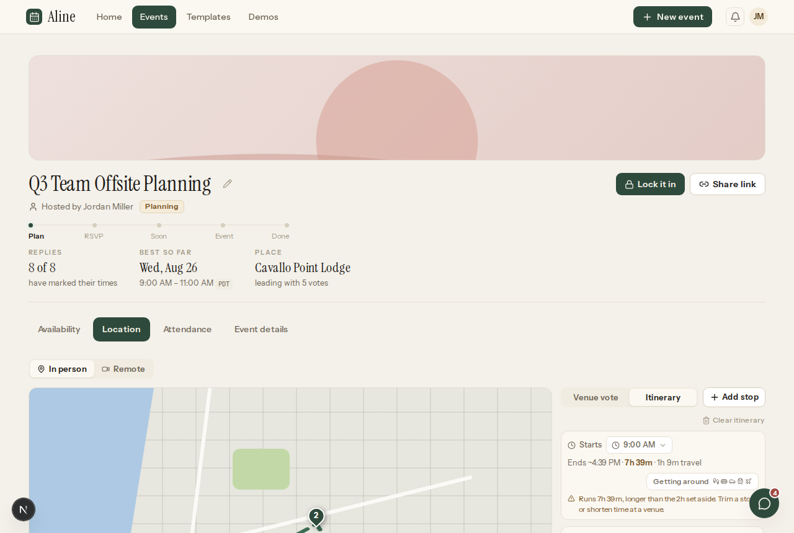
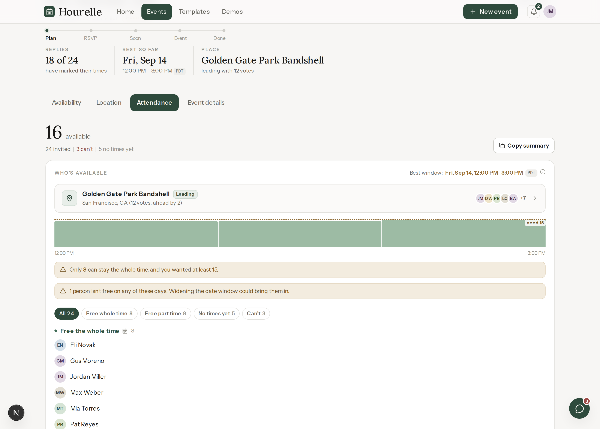
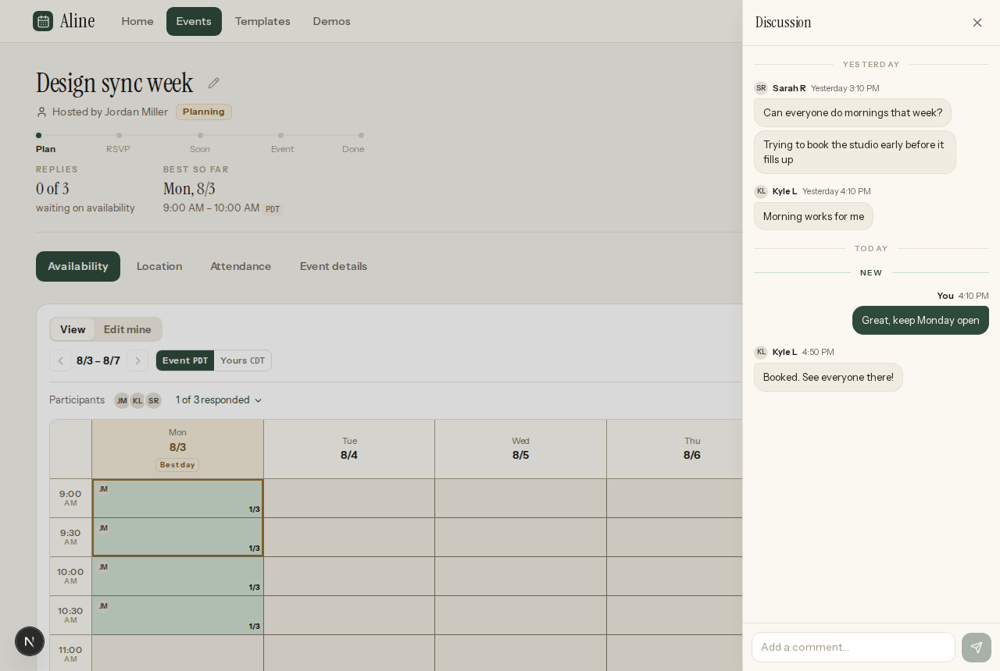
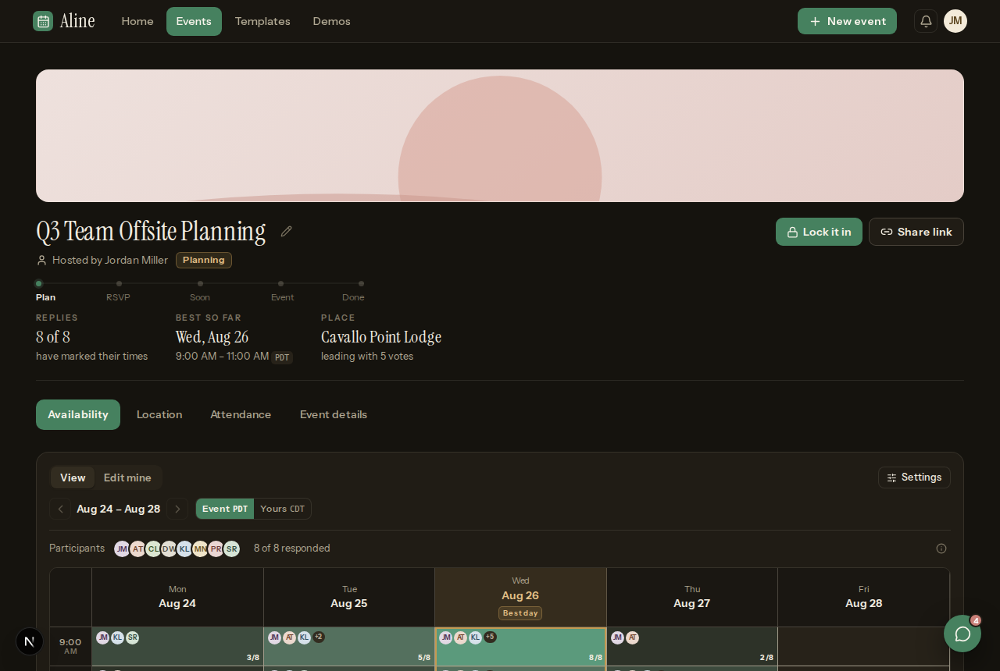
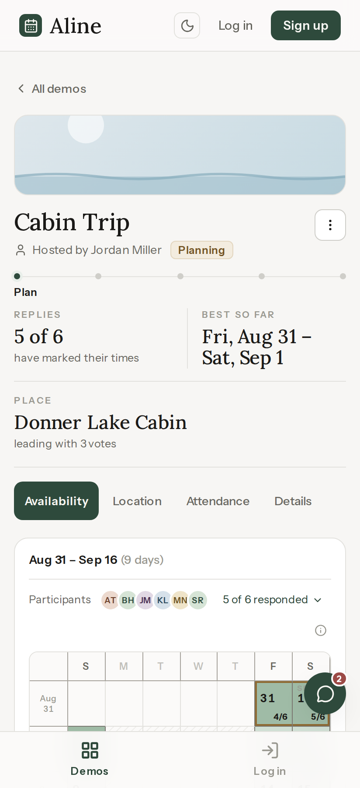

# Hourelle

Find the hour everyone can make.

Hourelle is an event coordination app, built as a modern replacement for when2meet. One link covers the whole life of a plan: finding a time everyone can make, voting on where to go, building a route for multi-stop days, tracking who is actually coming, and talking it over in a per-event chat. Guests join from a share link with just their name, no account needed.

Live at **[hourelle.vercel.app](https://hourelle.vercel.app)** — the **Demos** tab has fully populated sample events, so you can try every surface without signing up.



## What it does

- **Availability grid** — sweep across the cells to mark when you're free, and drag back along the sweep to take part of it back. The time rail reads like a chart axis, each time sitting on the line that opens its row. Click a block to fine-tune either edge to the minute, and the whole group's answers show as a live heat map with the best window framed.
- **Whole-day polls get a calendar** — a trip or a multi-day plan is answered on real weeks with weekday columns, so the run of days everyone can make is visible whole and never cut in half by a month break. A weekday heading marks that weekday across the poll, the left rail marks a week.
- **Location voting and itineraries** — suggest places on a map, run a ballot, or chain stops into a routed itinerary with travel-time estimates. The host decides whether the plan is one venue or a route.
- **Attendance** — see who can make the locked-in plan, who arrives late or leaves early, and where the headcount peaks across stops. Scales by summarising: exceptions get a row, everyone else gets a group.
- **Event chat, live** — a discussion drawer on every event, with unread tracking, presence, and typing indicators.
- **Calendar import** — pull free time from Google Calendar. One tap fills your grid, a toast says how much landed, and Undo takes it right back.
- **Accounts and guests** — sign in with Google or an email magic link, or join as a guest with just a name. What you answered as a guest follows you if you make an account later. Hosts keep host powers; guests get everything else.
- **Email** — invites, nudges to people who have not replied, and reminders before the day.
- **Two finished themes** — warm paper and warm charcoal, four appearances, and a 24-hour clock preference. Everything works from a 360px phone upward, with no sideways scrolling on the grids.

## Screenshots

| | |
|---|---|
|  A whole-day poll, answered on a calendar |  Location: map, ballot, itinerary |
|  Attendance across a multi-stop day |  The discussion drawer |
|  The same grid in dark |  A whole week on a phone, no sideways scroll |

## How it's built

- **Next.js (App Router) + TypeScript**, styled with **Tailwind** on a token system: two themes driven entirely by CSS variables, Lora for display type, Instrument Sans for everything else.
- **GSAP** for the animations that matter: drawer slides, drag feedback, progress fills.
- **Supabase** for storage, auth and realtime. Events are documents in Postgres with row-level security; the things everybody writes at once live in their own tables instead, so nobody's answer can overwrite anybody else's — chat is one row per message, availability one row per person per event, and a vote *is* a row. Presence and typing ride a realtime channel rather than a table.
- **Local first, in both directions.** The UI reads and writes localStorage synchronously and never waits on the network; the cloud syncs in the background and merges back in. With no Supabase keys in the environment the whole backend no-ops and the app runs entirely in the browser, which is also how the demos work.
- **Schema lives in `supabase/migrations`**, applied in order. Each backend phase has a walkthrough in `docs/`.

## Run it

```bash
npm install
npm run dev
```

Open http://localhost:3000. Copy `.env.example` to `.env.local` and fill in the Supabase keys if you want accounts and sync; leave it empty and everything still works, stored in your browser.
