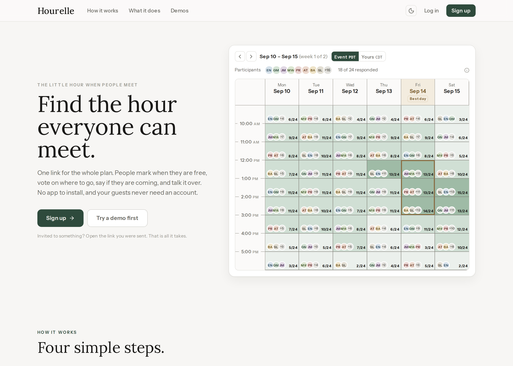

<div align="center">

# Hourelle

**Find the hour everyone can meet.**

Event coordination from the first "when are you free?" to the reminder on the morning of.
One link covers finding a time, choosing a place, building a route, tracking who is coming,
and talking it over.

[**hourelle.com**](https://hourelle.com) &nbsp;&nbsp; [Demos](https://hourelle.com/demos) &nbsp;&nbsp; [Report a bug](https://hourelle.com/help)

<sub>Next.js 16 &nbsp;|&nbsp; React 19 &nbsp;|&nbsp; TypeScript &nbsp;|&nbsp; Tailwind CSS 4 &nbsp;|&nbsp; Radix UI &nbsp;|&nbsp; Supabase &nbsp;|&nbsp; GSAP &nbsp;|&nbsp; Leaflet</sub>

</div>



---

## Contents

- [What it does](#what-it-does)
- [Screenshots](#screenshots)
- [Architecture](#architecture)
- [Getting started](#getting-started)
- [Configuration](#configuration)
- [Database](#database)
- [Email and reminders](#email-and-reminders)
- [Project layout](#project-layout)
- [Design system](#design-system)
- [Design notes](#design-notes)

---

## What it does

Hourelle is a modern replacement for when2meet that does not stop at the calendar grid.
A plan has a whole life, and all of it lives behind one share link.

### Finding a time

Every event starts from one of three answers to "when": **times of day** (people drag across
the hours they are free), **whole days** (people tap the days they can make), or **the date
is set** (one day with hours, one day all day, or a run of days from, say, Friday at six to
Sunday at noon). A set date goes straight to yes or no.

For a time poll, the host picks the slot size, a daily window drawn as a band of the day
that steps by that slot, and how long the event needs, on a track that runs from a quarter
hour to a whole day in steps that widen as the length grows. The length is its own measure:
the best time can start or end partway through a slot, and the grid outlines it exactly.

An availability grid you sweep across to mark when you are free, and sweep back along to
take part of it back. Answers are stored as **minute intervals**, not half-hour boxes, so a
block can start at 8:20 and the edges can be nudged to the minute after the fact. The whole
group's answers render as a live heat map with the best window framed, and the search can
favour either the most people who can stay the whole time or the fullest room on average.

Multi-day plans get a different question. A **day poll** is answered on real calendar weeks
with weekday columns, so a run of days everyone can make reads as one block and never gets
cut in half by a month boundary.

Importing free time from **Google Calendar or Outlook** is built and behind a switch
(`NEXT_PUBLIC_CALENDAR_IMPORT_ON`) while the provider setup is finished; until then the
Import button says it is coming soon. Switched on, one tap fills the grid, a toast says how
much landed, and Undo takes it straight back out. Imported busy blocks are drawn striped and
kept apart from the answer, so painting over them never loses what the calendar said.

### Choosing a place

Suggest places on a real map (OpenStreetMap tiles, Photon and Nominatim for search, no API
key needed), then either run a ballot or chain the winners into a routed **itinerary**. Legs
get real driving distance and minutes from OSRM, and the schedule flows dwell time and
travel through the day, so moving one stop moves every clock after it. The host decides
whether the plan is one venue, a route, an online call, or a question for later.

### Who is coming

Once a time and place are locked in, the RSVP round opens with an assumption rather than a
blank: anyone whose marked times cover the slot starts as going, and can undo it. The
attendance view answers "who is in the room, and when" for a single venue (a headcount band
across the window, name chips for everyone there the whole time, a timing bar for each
person who comes and goes), and "where does the headcount peak" across a multi-stop day,
with the people who miss a stop grouped by the stops they miss. Both are built to summarise
rather than enumerate, so the page stays short while the guest list grows, and a name filter
appears once it is long. **Copy summary** writes the plan out as a message ready for a
group chat: when, where, how many can make it, and who is still missing, by first name.

### Everything else

| | |
|---|---|
| **Live discussion** | One chat per event, with unread counts, presence and typing indicators. Someone who joins later starts the chat at the moment they arrived, and the room is told when they do. |
| **Accounts and guests** | Log in with Google, Microsoft or an email link, or join as a guest with just a name. A guest who leaves an email is sent their own link back, for any device. Answers given as a guest follow you if you make an account later. |
| **The host's list** | Invite by email or from past events. Removing someone, or someone leaving, takes everything they added with them: times, votes, and their lines in the chat. |
| **Email** | Personal invite links, a guest's own way back, nudges to people who have not replied, a lock-in announcement with a calendar file attached, reply activity for hosts, and reminders the day before and the day of. |
| **Add to calendar** | Google Calendar, Outlook, or an `.ics` file for anything else, for a timed slot, a whole day, or a run of days. |
| **Learning the app** | A short tour on a practice event of your own, one-line hints where people stall, and four silent clips on the Help page. |
| **Accessible** | Every dropdown, slider, select, switch and tooltip sits on Radix, so they work from the keyboard and speak to screen readers. Settings adds reduced motion, underlined links and a bold focus ring, and there is a high-contrast appearance. |
| **Two finished themes** | Warm paper and warm charcoal, with four appearances (house, Studio, Daylight, High contrast), following the device until you choose, and a 24-hour clock preference. |
| **Hourelle Plus** | Hosting stays free. Plus is sold through Stripe Checkout, and its webhook is the only thing that can switch it on. |
| **Works everywhere** | Every screen is built for a 360px phone upward. Grids scroll inside their own box, never the page, and the chat and places panel take the whole screen on a phone. |

---

## Screenshots

| | |
|---|---|
|  **Availability.** The week, the heat map, the best window framed. |  **The same grid, dark.** Both themes are first class. |
|  **Day polls.** Trips ask which days, on real weeks. |  **Place and route.** Real roads, real travel time. |
|  **Attendance.** Grouped, not listed one person per row. |  **Discussion.** Live, per event, guests included. |
|  **Home.** What is next, what you host, what you were invited to. |  **On a phone.** Bottom tab bar, no sideways scroll. |

---

## Architecture

### Local first, in both directions

The UI reads and writes `localStorage` synchronously and never waits on the network. The
cloud syncs in the background and merges back in. With no Supabase keys in the environment
the entire backend no-ops and the app runs completely in the browser, which is also how the
demos work and how you can develop without an account.

```
  component  ──write──▶  lib/events  ──▶  localStorage   (instant, always)
                              │
                              └──▶  lib/remote  ──▶  Supabase   (background, best effort)
                                          ▲
                Supabase Realtime ────────┘   (someone else's change lands in the cache)
```

### What travels as a document, and what travels as rows

An event is a JSON document in Postgres, which keeps the UI's own shapes as the source of
truth. Three things are deliberately lifted out of it, all for the same reason: they are
written by everybody at once, and a document write replaces the whole thing.

| Data | Storage | Why |
|---|---|---|
| The event itself | One `jsonb` document | Only the host reshapes it |
| Chat messages | One row per message | Appending cannot clobber anyone |
| Availability | One row per person per event | Two people marking at once never overwrite each other |
| Votes | One row per vote | Casting is an insert, taking it back is a delete |
| Presence and typing | A Realtime channel, never stored | True for a few seconds, worthless after |

Each of those moves was a migration, and the sync layer folds the rows back into the
document shape the rest of the app reads, so no component knows the difference.

### Identity

Reads are open at the database, because holding the share link *is* the permission. Scoping
therefore happens in the client: only events this identity is part of are pulled, listed or
accepted from Realtime. "Part of" means host, a participant by account id, a participant by
the email an account signed up with, or an event this browser holds a guest session for.

A document that arrives from the cloud is another browser's view of the event, so the two
fields that are theirs and not yours (`hostedByYou`, and the `you` marker) are rebuilt for
the local identity before it ever reaches the cache.

### Stack

| Layer | Choice |
|---|---|
| Framework | Next.js 16, App Router, React 19, TypeScript strict |
| Styling | Tailwind CSS 4, with the theme declared in `@theme` inside `globals.css` |
| Type | Lora for display, Instrument Sans for everything else |
| Database, auth, realtime | Supabase (Postgres with row-level security) |
| Components | Radix UI primitives (popover, select, slider, switch, tooltip), styled with the house tokens |
| Animation | GSAP with `@gsap/react`, always inside `useGSAP()` |
| Maps | Leaflet, OpenStreetMap tiles, Photon and Nominatim for search, OSRM for routing |
| Email | Resend, triggered from route handlers and a Vercel cron job |
| Payments | Stripe Checkout and the customer portal, confirmed by webhook |
| Hosting | Vercel |

---

## Getting started

Node 20 or newer.

```bash
git clone https://github.com/OfficialChanHen/Hourelle.git
cd Hourelle
npm install
npm run dev
```

Open <http://localhost:3000>. With no environment file you get the whole app running on
browser storage, demos included. That is enough to work on any screen in the product.

```bash
npm run dev     # development server
npm run build   # production build
npm start       # serve the production build
npm run lint    # eslint
```

> **Note**
> Some behaviour differs between `next dev` and a production build, because the static
> client pages read the address through `useSearchParams`. If you are chasing a bug with a
> query parameter in it, reproduce it against `npm run build && npm start`.

---

## Configuration

Copy `.env.example` to `.env.local` and fill in only what you need. Every block is optional
and the app degrades honestly without it.

| Variable | Needed for |
|---|---|
| `NEXT_PUBLIC_SUPABASE_URL`, `NEXT_PUBLIC_SUPABASE_ANON_KEY` | Accounts, sync, realtime. Unset, everything stays in the browser. |
| `SUPABASE_SERVICE_ROLE_KEY` | Account deletion, the reminder job, a guest's link email, and clearing a removed person's chat lines. Server only, never expose it. |
| `RESEND_API_KEY`, `MAIL_FROM_EMAIL`, `NEXT_PUBLIC_MAIL_ON` | Invites, nudges, lock-in announcements and reminders. Send buttons stay hidden until `NEXT_PUBLIC_MAIL_ON=1`. |
| `NEXT_PUBLIC_SITE_URL` | Where links in emails point. |
| `CRON_SECRET` | Authorises the reminder cron call. |
| `FEEDBACK_TO_EMAIL`, `FEEDBACK_FROM_EMAIL` | Emailing a copy of Help page bug reports. |
| `NEXT_PUBLIC_MAP_TILE_URL`, `NEXT_PUBLIC_MAP_TILE_ATTRIBUTION` | A keyed tile provider, once OpenStreetMap's public tiles are not enough. |
| `NEXT_PUBLIC_CALENDAR_IMPORT_ON` | Google Calendar and Outlook import. Until it is `1`, Import says "Coming soon". |
| `STRIPE_SECRET_KEY`, `STRIPE_PRICE_MONTHLY`, `STRIPE_PRICE_YEARLY`, `STRIPE_WEBHOOK_SECRET`, `NEXT_PUBLIC_BILLING_ON` | Selling Hourelle Plus. Buy buttons stay hidden until `NEXT_PUBLIC_BILLING_ON=1`. |
| `NEXT_PUBLIC_SUPPORT_URL` | Where "Buy me a coffee" points. Unset, the link is hidden. |

Two switches live in the Supabase dashboard rather than in the environment: the **Azure**
provider (the Microsoft door) and **manual identity linking** under Authentication →
Advanced. Google Calendar import also needs the Google Calendar API enabled on the Google
Cloud project behind your OAuth client.

---

## Database

Schema lives in `supabase/migrations`, applied in order in the Supabase SQL editor.

| | |
|---|---|
| `0001` | `events`, one `jsonb` document per event |
| `0002` | `profiles`, mirroring `auth.users` with the name and avatar colour |
| `0003` | Row-level security on events, plus a trigger guarding host-only fields |
| `0004` | `messages`, one row per chat line |
| `0005` | `feedback`, bug reports from the Help page |
| `0006` | `email_log` and reminder preferences |
| `0007` | A chosen avatar colour, as opposed to a dealt one |
| `0008` | `availability` and `votes` leave the event document |
| `0009` | Backfill for anything `0008` missed |
| `0010` | Profiles for accounts that predate the trigger |
| `0011` | When an account accepted the terms, and which version |
| `0012` | Plan, and interest in Plus |
| `0013` | A public `covers` bucket: a host's photo leaves the event document |
| `0014` | Billing: where a plan came from and until when, guarded so only the server can grant it |
| `0015` | The trigger learns the rest of the host-only fields (length, best-time mode, deadlines) |
| `0016` | Profiles stop being readable by anyone; email lookups go through two narrow functions |

Every migration carries its own reasoning in a header comment: what moved, and what
went wrong before it did.

---

## Email and reminders

Five kinds of message go out from route handlers under `src/app/api/mail/` (invites, a
guest's own link, nudges, the lock-in announcement, and reply activity for hosts), and
reminders come from a Vercel cron job hitting `/api/cron/reminders` once a day (see
`vercel.json`).

Nothing is ever sent twice. Every message claims a row in `email_log` under a unique key
before it goes out, so two overlapping runs cannot both send, and a failed send releases the
claim for the next run. Reminders are worked out per event in the event's own timezone: the
day before, and the day of.

---

## Project layout

```
src/
├── app/
│   ├── page.tsx                 the landing page, outside the app chrome
│   ├── (main)/                  everything behind the app header
│   │   ├── home/  events/  create/  demos/  templates/
│   │   ├── settings/  profile/  notifications/  plans/  help/  about/
│   │   └── events/[id]/
│   │       ├── _components/     the event surface: header, tabs, panels
│   │       │   └── availability/  the grid, its parts and its pure helpers
│   │       └── join/            the guest join flow
│   ├── auth/                    sign-in, OAuth callback, password reset
│   └── api/                     mail, cron, feedback, billing, account deletion, removal clean-up
├── components/
│   ├── ui/                      the shared kit: Avatar, Badge, Popover, Cover, …
│   ├── landing/                 the live demos on the front page
│   └── Header, MobileTabBar, EventMap, AccessBoundary, …
├── hooks/                       useAccess, useEventRoom, useLiveEvents, …
├── lib/
│   ├── events.ts                the domain model and every operation on it
│   ├── availability.ts          pure interval maths, shared with the sync layer
│   ├── remote.ts                localStorage ↔ Supabase, push, pull and realtime
│   ├── session.ts               identity, read synchronously, filled in the background
│   ├── geo.ts  travel.ts  itinerary.ts   maps, routing and schedule timing
│   └── server/                  server-only: mail, reminders, service-role access
└── content/                     legal documents and plan copy
```

---

## Design system

Two themes and four appearances, all driven from CSS custom properties declared in
`src/app/globals.css`. Components only ever use semantic tokens (`bg-s1`, `text-dim`,
`bg-accent text-on-accent`), never raw hex, so both themes and every appearance follow for
free.

The look is editorial: warm neutral or warm charcoal surfaces, one deep green accent, Lora
for display type over Instrument Sans, hairline rules, and generous whitespace. Colour has
strict roles, and they are not decorative:

| Token | Means |
|---|---|
| `--accent` | The single signature colour. Every call to action, link, active state and selected tab. |
| `--teal` | Confirmed, going, full attendance, and the availability heat ramp. |
| `--ochre` | Planning, partial attendance, caution, arriving late. |
| `--brick` | Absent, conflict, declined, danger. |

Avatar colours are decorative identity only and never carry meaning.

The full brief, including what never to do, lives in [`CLAUDE.md`](CLAUDE.md).

---

## Design notes

[`docs/planning-shapes.md`](docs/planning-shapes.md) is the one piece of design reasoning that ships with the
repo, and it is the one worth reading first: every event answers two independent
questions, **when** and **where**, and each of them arrives either open or already
answered. Those four combinations are the whole lifecycle, and most of the decisions
in `lib/events.ts` follow from them.

The rest of `docs/` is working notes and stays local. Each backend phase has a
walkthrough there covering what moved and why, but it is not part of the published
repository.

---

<div align="center">

Free to host, free to join.
If it saved you a group chat, [a coffee](https://www.buymeacoffee.com/ChanHen) keeps the reminders going.

</div>
