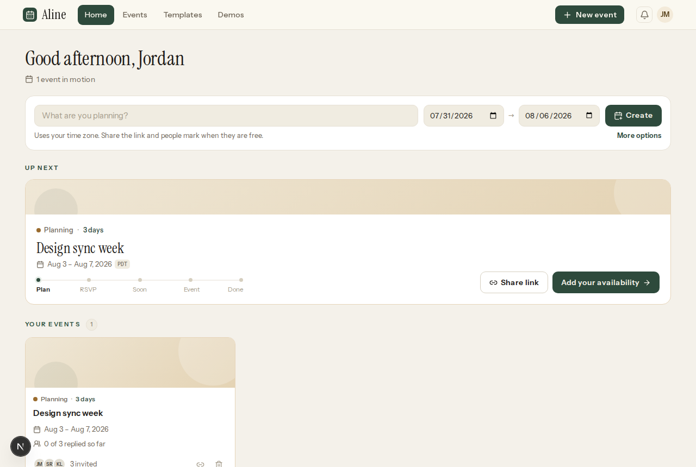
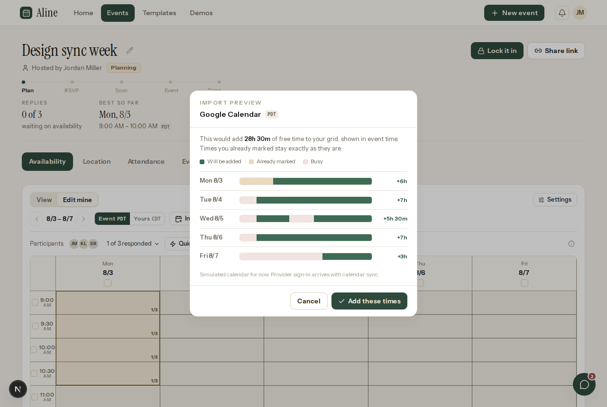

# Aline

Aline is an event coordination app, built as a modern replacement for when2meet. One link covers the whole life of a plan: finding a time everyone can make, voting on where to go, building a route for multi-stop days, tracking who is actually coming, and talking it over in a per-event chat. Guests join from a share link with just their name, no account needed.


## What it does

- **Availability grid** — mark when you're free by dragging, with minute-precise edge handles, quick fills, and a live heat map of the whole group. Day polls handle trips and multi-day plans.
- **Calendar import** — pull free time straight from Google Calendar or Outlook (simulated for now), preview what it would add per day, apply in one tap, undo in one more.
- **Location voting and itineraries** — suggest places on a map, run a ballot, or chain stops into a routed itinerary with travel-time estimates.
- **Attendance** — see who can make the locked-in plan, who arrives late or leaves early, and where the headcount peaks across stops.
- **Event chat** — a discussion drawer on every event, with unread tracking and read-marks per browser.
- **Guest flow** — the share link lands on a join page that asks for a name and nothing else. Hosts keep host powers; guests get everything else.
- **Two finished themes** — warm paper and warm charcoal, plus optional color palettes and a 24-hour clock preference.

## Screenshots

| | |
|---|---|
|  Home, with the next event up front |  Location tab: map, ballot, itinerary |
|  The discussion drawer |  Calendar import preview |
|  The same grid in dark |  On a phone |

## How it's built

- **Next.js (App Router) + TypeScript**, styled with **Tailwind** on a token system: two themes driven entirely by CSS variables, Instrument Serif for display type, Instrument Sans for everything else.
- **GSAP** for the animations that matter: drawer slides, drag feedback, progress fills.
- **All data lives in the browser** for now (localStorage), behind two seams: `src/lib/events.ts` owns event data, `src/lib/prefs.ts` owns device preferences. No server, no accounts, nothing leaves your machine.

That last point is deliberate. The UI is being finished first; the backend (Supabase, auth, realtime) comes after, and the seams are already in place so it swaps in without touching the UI.

## Run it

```bash
npm install
npm run dev
```

Open http://localhost:3000. The **Demos** tab in the nav has sample events with full data, so you can try every surface without setting anything up.
